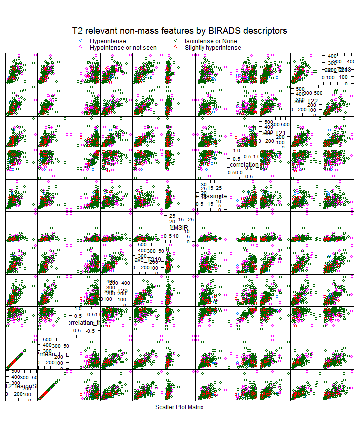

T2 features 
========================================================

- This code analysis T2w feature relevance among mass and non-mass lesions
- Plot z-scores between relevant T2w features for mass and non-mass lesions
- Then, analyzes added value of T2w features on discrimination ability (added pAUC ROC value)


```r
require(ggplot2)
```

```
## Loading required package: ggplot2
```

```r
library("RSQLite")
```

```
## Loading required package: DBI
```

```r
setwd("Z:/Cristina/MassNonmass/Section 2 - Experiments/featureRelevance")
```


```r
read_T2data <- function(subdata) {
  sqlite <- dbDriver("SQLite")
  conn <- dbConnect(sqlite, "stage1T2updatedFeatures.db")
  
  # 2) all T1W features
  lesionsQuery <- dbGetQuery(conn, "SELECT *
           FROM  stage1features
           INNER JOIN lesion ON (stage1features.lesion_id = lesion.lesion_id)
           INNER JOIN f_T2 ON (stage1features.lesion_id = f_T2.lesion_id)")
  
  # prune entries and extract feature subsets
  # corresponds to 5 entries lesion info, 34 dynamic, 19 morpho, 34 texture fueatures
  lesionfields =  names(lesionsQuery)
  lesioninfo = lesionsQuery[c(2,130,130:154)]
  T2info = lesionsQuery[c(155:202)]
  T2features = lesionsQuery[c(156,153,157,165:166,168:202,104:123)]
  
  T2features$lesion_label <- as.factor(T2features$lesion_label)
  summary(T2features$lesion_label)
 
    
  if(subdata=="mass"){
    # organized the data by subdata
    M<-subset(T2features, lesion_label=="massB" | lesion_label=="massM")
    ifelse( M$lesion_label == "massB", "NC", "C") -> M$lesion_label
    T2features = M
    
  }
  if(subdata=="nonmass"){
    # organized the data by subdata
    N<-subset(T2features, lesion_label=="nonmassB" | lesion_label=="nonmassM")
    ifelse( N$lesion_label == "nonmassB", "NC", "C") -> N$lesion_label
    T2features = N
    
  }
  if(subdata=="stage1"){
    # organized the data by subdata
    M<-subset(T2features, lesion_label=="massB" | lesion_label=="massM")
    ifelse( M$lesion_label == "massB", "mass", "mass") -> M$lesion_label
    N<-subset(T2features, lesion_label=="nonmassB" | lesion_label=="nonmassM")
    ifelse( N$lesion_label == "nonmassB", "nonmass", "nonmass") -> N$lesion_label
    T2features = data.frame(rbind(M,N)) 

  }
  
  # procees data
  T2features$lesion_label <- as.factor(T2features$lesion_label)

  return(T2features)
}

subset_feature_selection <- function(allfeatures) {
  library(caret)
  library(mlbench)
  library(pROC)

  ### Pre-p[rocess
  predictors <- na.omit(allfeatures)
  outcome <- predictors$lesion_label #[c(1,5:10)] # select 1st and 5th thru 10th variables

  set.seed(2)
  inTrain <- createDataPartition(y = outcome, ## the outcome data are needed
                                 p = .75, ## The percentage of data in the training set
                                 list = FALSE) ## The format of the results. 

  training <- predictors[ inTrain,]
  testing <- predictors[-inTrain,]
  nrow( training )
  nrow( testing )

  ############ Recursive Feature Selection via caret 
  # fit models with subset sizes of 1:10, 15, 20, 25, 30, 35, 40, 45, 50, 55
  subsets <- c( c(1:10),seq(15,50,5) )

  # create control object for Controlling the Feature Selection Algorithms
  # Right now performs 10 repeated cross validation
  RFctrl <- rfeControl(functions = treebagFuncs, 
                       method = "repeatedcv", 
                       repeats = 1,
                       verbose = FALSE,
                       returnResamp = "all")

  set.seed(10)
  # Run recursive feature selection (RFE) algorithm
  rfSelProfile <- rfe( predictors[, 3:ncol(predictors)], outcome, sizes = subsets, rfeControl = RFctrl)

  print(rfSelProfile )

  # The predictors function can be used to get a text string of variable names that were picked in      the final model. 
  # The model can be used to get best subset and predictions for future or test samples.
  print(rfSelProfile$bestSubset)
  print(rfSelProfile$optVariables)

  # Also the resampling results are stored in the sub-object 
  # and can be used with several lattice functions. Univariate lattice functions (densityplot, histogram) 
  # can be used to plot the resampling distribution while bivariate functions (xyplot, stripplot) 
  # can be used to plot the distributions for different subset sizes.
  #head(rfSelProfile$resample)

  # plot to visualize the results. 
  plot(rfSelProfile, type = c("g", "o"))

  ## Create dataframe with one selected features
  selfeatures = data.frame(training[,c("lesion_label",rfSelProfile$optVariables)])

  ################
  ## For picking subset sizes:
  ## Maximize Accuracy
  performance <- data.frame(Accuracy = rfSelProfile$results$Accuracy,
            Variables = rfSelProfile$results$Variables)

  ## Percent Loss in performance (positive)
  performance$PctLoss <- (max(performance$Accuracy ) - performance$Accuracy )/max(performance$Accuracy )*100

  plot(performance$Variables , performance$Accuracy, type="p",  col="blue", xlab="Variables", ylab="Accuracy")
  lines(performance$Variables , performance$Accuracy, col="blue") 
  grid(10, 10, col = "lightgray", lty = "dotted", lwd = par("lwd"))
  Axis(at =  seq(0, 80, 5), side=1, labels = TRUE)

  absoluteBest <- pickSizeBest(performance, metric = "Accuracy", maximize = TRUE)
  within5Pct <- pickSizeTolerance(performance, metric = "Accuracy", maximize = TRUE)

  cat("numerically optimal:", performance$Accuracy[performance$Variables==absoluteBest ],"Accuracy with subset",absoluteBest, "\n")
  cat("Accepting a 1.5% Accuracy loss:", performance$Accuracy[performance$Variables==within5Pct ],"Accuracy with subset",within5Pct, "\n")

  plot(performance$Variables , performance$PctLoss, type="p",  col="blue", xlab="Variables", ylab="Accuracy % Loss")
  lines(performance$Variables , performance$PctLoss, col="blue") 
  ### Add those points to plot
  points(absoluteBest, performance$PctLoss[performance$Variables==absoluteBest], type="p", col="red", bg="red", pch=22, lwd=1)
  points(within5Pct, performance$PctLoss[performance$Variables==within5Pct], type="p", col="black", bg="black", pch=25, lwd=1)
  # Organize plot
  grid(10, 10, col = "lightgray", lty = "dotted", lwd = par("lwd"))
  Axis(at =  seq(0, 80, 5), side=1, labels = TRUE)
  legend("topright", legend = c("absolute Best Set","within tolerance Loss "), pch = c(22,25), col=c("red","black"), pt.bg=c("red","black"), text.col=c("red","black"))

  ################
  ## Variable importance evaluation
  # Random Forest: from the R package
  selvarImp <- varImp(rfSelProfile, scale = TRUE)

  selfeatureswtol = data.frame(allfeatures[,c("lesion_label",rownames(selvarImp)[1:within5Pct])])

  output<-list(selfeatures=selfeatureswtol, selvarImp=selvarImp, within5Pct=within5Pct)
  return(output)  
}

# read datasets
T2massfeatures = read_T2data(subdata="mass")
T2nonmassfeatures = read_T2data(subdata="nonmass")
T2allfeatures = read_T2data(subdata="all")

# format datasets for B or M
T2allfeaturesBorM = T2allfeatures
T2massfeaturesBorM = T2massfeatures
T2nonmassfeaturesBorM = T2nonmassfeatures

output_onlyMass = subset_feature_selection(T2massfeaturesBorM)
```

```
## Loading required package: cluster
## Loading required package: foreach
## Loading required package: lattice
## Loading required package: plyr
## Loading required package: reshape2
## Type 'citation("pROC")' for a citation.
## 
## Attaching package: 'pROC'
## 
## The following object(s) are masked from 'package:stats':
## 
##     cov, smooth, var
## 
## Loading required package: class
```

```
## Warning: executing %dopar% sequentially: no parallel backend registered
```

```
## Loading required package: rpart
## Loading required package: MASS
## Loading required package: survival
## Loading required package: splines
## Loading required package: nnet
## Loading required package: prodlim
## KernSmooth 2.23 loaded
## Copyright M. P. Wand 1997-2009
```

```
## 
## Recursive feature selection
## 
## Outer resampling method: Cross-Validation (10 fold, repeated 1 times) 
## 
## Resampling performance over subset size:
## 
##  Variables Accuracy Kappa AccuracySD KappaSD Selected
##          1    0.592 0.140     0.0786  0.1596         
##          2    0.600 0.155     0.0378  0.0927         
##          3    0.600 0.151     0.0781  0.1582         
##          4    0.608 0.169     0.0834  0.1735         
##          5    0.619 0.188     0.0979  0.2055         
##          6    0.618 0.182     0.0638  0.1319         
##          7    0.639 0.234     0.0591  0.1200         
##          8    0.608 0.156     0.0554  0.1008         
##          9    0.623 0.207     0.0534  0.1089         
##         10    0.670 0.302     0.0646  0.1460        *
##         15    0.631 0.216     0.0640  0.1304         
##         20    0.631 0.214     0.0511  0.1166         
##         25    0.626 0.207     0.0897  0.2031         
##         30    0.644 0.256     0.0477  0.0981         
##         35    0.636 0.235     0.0529  0.1130         
##         40    0.631 0.214     0.0692  0.1445         
##         45    0.631 0.218     0.0607  0.1343         
##         50    0.651 0.259     0.0643  0.1551         
##         58    0.639 0.227     0.0761  0.1689         
## 
## The top 5 variables (out of 10):
##    T2texture_ASM_threeQuaRad, T2texture_ASM_quarterRad, T2texture_ASM_halfRad, LMSIR, T2_lesionSIstd
## 
## [1] 10
##  [1] "T2texture_ASM_threeQuaRad" "T2texture_ASM_quarterRad"  "T2texture_ASM_halfRad"     "LMSIR"                     "T2_lesionSIstd"            "T2skew_F_r_i"              "T2_lesionSI"               "T2RGH_var"                
##  [9] "T2texture_ASM_zero"        "T2RGH_mean"
```

 

```
## numerically optimal: 0.6704 Accuracy with subset 10 
## Accepting a 1.5% Accuracy loss: 0.6704 Accuracy with subset 10
```

 

```r
output_onlyNonmass = subset_feature_selection(T2nonmassfeaturesBorM)
```

```
## 
## Recursive feature selection
## 
## Outer resampling method: Cross-Validation (10 fold, repeated 1 times) 
## 
## Resampling performance over subset size:
## 
##  Variables Accuracy  Kappa AccuracySD KappaSD Selected
##          1    0.556 0.0769     0.1297   0.282         
##          2    0.576 0.0992     0.1050   0.246         
##          3    0.573 0.0988     0.0533   0.136         
##          4    0.618 0.1773     0.0967   0.223         
##          5    0.588 0.1435     0.0975   0.192         
##          6    0.546 0.0454     0.0627   0.129         
##          7    0.601 0.1430     0.1180   0.256         
##          8    0.595 0.1297     0.0880   0.165         
##          9    0.632 0.2236     0.0794   0.152         
##         10    0.577 0.1077     0.0965   0.190         
##         15    0.611 0.1719     0.0874   0.179         
##         20    0.612 0.1772     0.1189   0.249         
##         25    0.634 0.2000     0.0712   0.159         
##         30    0.617 0.1649     0.0797   0.165         
##         35    0.634 0.2072     0.0923   0.203         
##         40    0.607 0.1470     0.0692   0.161         
##         45    0.585 0.0888     0.1121   0.246         
##         50    0.558 0.0483     0.0703   0.192         
##         58    0.645 0.2169     0.1176   0.267        *
## 
## The top 5 variables (out of 58):
##    T2grad_margin, T2grad_margin_var, LMSIR, T2_lesionSI, T2_lesionSIstd
## 
## [1] 58
##  [1] "T2grad_margin"                       "T2grad_margin_var"                   "LMSIR"                               "T2_lesionSI"                         "T2_lesionSIstd"                      "T2mean_F_r_i"                       
##  [7] "ave_T22"                             "T2RGH_mean"                          "ave_T219"                            "ave_T25"                             "T2kurt_F_r_i"                        "ave_T23"                            
## [13] "ave_T29"                             "T2max_F_r_i"                         "T2RGH_var"                           "ave_T24"                             "ave_T26"                             "ave_T210"                           
## [19] "ave_T27"                             "T2min_F_r_i"                         "ave_T28"                             "ave_T218"                            "ave_T212"                            "ave_T21"                            
## [25] "ave_T216"                            "T2texture_correlation_zero"          "ave_T213"                            "ave_T211"                            "T2texture_ASM_halfRad"               "T2texture_correlation_threeQuaRad"  
## [31] "ave_T215"                            "ave_T217"                            "find_t2_signal_int"                  "T2texture_ASM_zero"                  "T2texture_ASM_threeQuaRad"           "T2texture_ASM_quarterRad"           
## [37] "T2skew_F_r_i"                        "T2texture_contrast_halfRad"          "T2texture_correlation_quarterRad"    "T2texture_correlation_halfRad"       "ave_T214"                            "ave_T20"                            
## [43] "T2texture_contrast_quarterRad"       "T2texture_contrast_zero"             "T2texture_contrast_threeQuaRad"      "T2texture_energy_quarterRad"         "T2texture_dissimilarity_zero"        "T2texture_dissimilarity_quarterRad" 
## [49] "T2texture_dissimilarity_threeQuaRad" "T2texture_dissimilarity_halfRad"     "T2texture_energy_threeQuaRad"        "T2texture_homogeneity_halfRad"       "T2texture_homogeneity_zero"          "T2var_F_r_i"                        
## [55] "T2texture_energy_zero"               "T2texture_energy_halfRad"            "T2texture_homogeneity_quarterRad"    "T2texture_homogeneity_threeQuaRad"
```

 

```
## numerically optimal: 0.6451 Accuracy with subset 58 
## Accepting a 1.5% Accuracy loss: 0.6451 Accuracy with subset 58
```

 

```r

selvarImpMass = output_onlyMass$selvarImp
selvarImpMass$SelectedFeatureGroup = "mass"
selvarImpNonMass = output_onlyNonmass$selvarImp
selvarImpNonMass$SelectedFeatureGroup = "nonmass"
allselvarImp = rbind(selvarImpMass, selvarImpNonMass)

library("lattice")
library("latticeExtra")
```

```
## Loading required package: RColorBrewer
## 
## Attaching package: 'latticeExtra'
## 
## The following object(s) are masked from 'package:ggplot2':
## 
##     layer
```

```r
require(ggplot2)

# plot
g <- ggplot(allselvarImp, aes(x = reorder(rownames(allselvarImp), allselvarImp$Overall),
    y = Overall, fill = SelectedFeatureGroup))
g + geom_bar() + coord_flip() + theme_bw(base_size = 16) + labs(title = "Selected features for Mass and Non-mass B vs. M lesions", 
    x = "", y = "variable importance ranking")
```

```
## Mapping a variable to y and also using stat="bin".
##   With stat="bin", it will attempt to set the y value to the count of cases in each group.
##   This can result in unexpected behavior and will not be allowed in a future version of ggplot2.
##   If you want y to represent counts of cases, use stat="bin" and don't map a variable to y.
##   If you want y to represent values in the data, use stat="identity".
##   See ?geom_bar for examples. (Deprecated; last used in version 0.9.2)
```

 

```r

# read for mass
T2massfeatures = read_T2data(subdata = "mass")
T2nonmassfeatures = read_T2data(subdata = "nonmass")

### print number of total lesions with T2w features
# before was ##   C / NC = 140 / 132
print(summary(T2massfeatures$lesion_label))
```

```
##   C  NC 
## 186 260
```

```r
# before was ##   C / NC = 63 / 65
print(summary(T2nonmassfeatures$lesion_label))
```

```
##   C  NC 
##  91 152
```


Random Forest feature relevance
=====

```r
library("Boruta")
```

```
## Loading required package: randomForest
## randomForest 4.6-7
## Type rfNews() to see new features/changes/bug fixes.
```

```r
require(data.table)
```

```
## Loading required package: data.table
```

```r
# Color codes: c('green', 'yellow', 'red', 'blue'), Confirmed, Tentative, Rejected and shadow.  Blue boxplots correspond to minimal, average and maximum Z score of a shadow attribute. Red Boruta mass: (to run boruta uncomment)
set.seed(111)
# load('Z:/Cristina/MassNonmass/Section1 - ExperimentsUpToDate/experimentsT2/results/borutaresults.RData')
T2massBoruta <- Boruta(lesion_label ~ ., data = na.omit(T2massfeatures[, 2:ncol(T2massfeatures)]), doTrace = 2, ntree = 5000)
```

```
## Initial round 1: ..........
##  27  attributes rejected after this test:  T2max_F_r_i T2kurt_F_r_i T2grad_margin T2grad_margin_var T2RGH_mean T2RGH_var T2texture_contrast_halfRad T2texture_contrast_threeQuaRad T2texture_homogeneity_halfRad T2texture_homogeneity_threeQuaRad T2texture_dissimilarity_halfRad T2texture_dissimilarity_threeQuaRad T2texture_correlation_zero T2texture_correlation_quarterRad ave_T22 ave_T24 ave_T25 ave_T26 ave_T27 ave_T28 ave_T29 ave_T210 ave_T212 ave_T214 ave_T215 ave_T216 ave_T217 
## 
## Initial round 2: ..........
## Initial round 3: ..........
##  2  attributes rejected after this test:  T2texture_correlation_halfRad T2texture_correlation_threeQuaRad 
## 
## Final round: ..........
##  9  attributes confirmed after this test:  find_t2_signal_int T2skew_F_r_i T2texture_ASM_quarterRad T2texture_ASM_halfRad T2texture_ASM_threeQuaRad T2texture_energy_zero T2texture_energy_quarterRad T2texture_energy_halfRad T2texture_energy_threeQuaRad 
## 
##  7  attributes rejected after this test:  LMSIR T2texture_contrast_zero T2texture_homogeneity_quarterRad T2texture_dissimilarity_zero ave_T23 ave_T211 ave_T213 
## ....
##  1  attributes confirmed after this test:  T2texture_ASM_zero 
## ....
##  1  attributes rejected after this test:  T2mean_F_r_i 
## ...
##  1  attributes rejected after this test:  ave_T21 
## ......
##  1  attributes rejected after this test:  ave_T218 
## ........
##  1  attributes confirmed after this test:  T2texture_contrast_quarterRad 
## ..............
##  1  attributes confirmed after this test:  T2texture_dissimilarity_quarterRad 
## ..........
##  1  attributes confirmed after this test:  ave_T219 
## ..........
##  1  attributes confirmed after this test:  T2_lesionSIstd 
## ..
##  1  attributes rejected after this test:  T2_lesionSI 
## .............................
```

```r
print(T2massBoruta)
```

```
## Boruta performed 130 randomForest runs in 28.83 mins.
##         14 attributes confirmed important: find_t2_signal_int T2_lesionSIstd T2skew_F_r_i T2texture_contrast_quarterRad T2texture_dissimilarity_quarterRad T2texture_ASM_zero T2texture_ASM_quarterRad T2texture_ASM_halfRad
## T2texture_ASM_threeQuaRad T2texture_energy_zero T2texture_energy_quarterRad T2texture_energy_halfRad T2texture_energy_threeQuaRad ave_T219
##         40 attributes confirmed unimportant: T2_lesionSI LMSIR T2max_F_r_i T2mean_F_r_i T2kurt_F_r_i T2grad_margin T2grad_margin_var T2RGH_mean T2RGH_var T2texture_contrast_zero T2texture_contrast_halfRad
## T2texture_contrast_threeQuaRad T2texture_homogeneity_quarterRad T2texture_homogeneity_halfRad T2texture_homogeneity_threeQuaRad T2texture_dissimilarity_zero T2texture_dissimilarity_halfRad T2texture_dissimilarity_threeQuaRad
## T2texture_correlation_zero T2texture_correlation_quarterRad T2texture_correlation_halfRad T2texture_correlation_threeQuaRad ave_T21 ave_T22 ave_T23 ave_T24 ave_T25 ave_T26 ave_T27 ave_T28 ave_T29 ave_T210 ave_T211 ave_T212
## ave_T213 ave_T214 ave_T215 ave_T216 ave_T217 ave_T218
##         4 tentative attributes left: T2min_F_r_i T2var_F_r_i T2texture_homogeneity_zero ave_T20
```

```r
plot(T2massBoruta)
```

 

```r

# Boruta non-mass:
set.seed(963)
T2nonmassBoruta <- Boruta(lesion_label ~ ., data = na.omit(T2nonmassfeatures[, 2:ncol(T2nonmassfeatures)]), doTrace = 2, ntree = 5000)
```

```
## Initial round 1: ..........
##  34  attributes rejected after this test:  find_t2_signal_int T2_lesionSIstd T2min_F_r_i T2max_F_r_i T2var_F_r_i T2skew_F_r_i T2kurt_F_r_i T2grad_margin T2grad_margin_var T2RGH_mean T2RGH_var T2texture_contrast_zero T2texture_contrast_quarterRad T2texture_contrast_halfRad T2texture_homogeneity_zero T2texture_homogeneity_quarterRad T2texture_homogeneity_halfRad T2texture_homogeneity_threeQuaRad T2texture_dissimilarity_quarterRad T2texture_dissimilarity_halfRad T2texture_correlation_zero T2texture_ASM_quarterRad T2texture_ASM_halfRad T2texture_ASM_threeQuaRad T2texture_energy_zero T2texture_energy_halfRad ave_T20 ave_T24 ave_T28 ave_T210 ave_T211 ave_T212 ave_T213 ave_T216 
## 
## Initial round 2: ..........
## Initial round 3: ..........
##  1  attributes rejected after this test:  ave_T214 
## 
## Final round: ..........
##  8  attributes rejected after this test:  T2texture_contrast_threeQuaRad T2texture_ASM_zero T2texture_energy_quarterRad T2texture_energy_threeQuaRad ave_T23 ave_T25 ave_T215 ave_T217 
## ....
##  1  attributes rejected after this test:  T2texture_correlation_quarterRad 
## ....
##  2  attributes confirmed after this test:  T2_lesionSI ave_T29 
## 
##  1  attributes rejected after this test:  ave_T27 
## ...
##  1  attributes confirmed after this test:  T2mean_F_r_i 
## .........
##  2  attributes rejected after this test:  T2texture_dissimilarity_threeQuaRad ave_T26 
## ...........
##  1  attributes confirmed after this test:  ave_T219 
## .............................................
##  1  attributes confirmed after this test:  T2texture_correlation_threeQuaRad 
## ..............
```

```r
print(T2nonmassBoruta)
```

```
## Boruta performed 130 randomForest runs in 2.131 mins.
##         5 attributes confirmed important: T2_lesionSI T2mean_F_r_i T2texture_correlation_threeQuaRad ave_T29 ave_T219
##         47 attributes confirmed unimportant: find_t2_signal_int T2_lesionSIstd T2min_F_r_i T2max_F_r_i T2var_F_r_i T2skew_F_r_i T2kurt_F_r_i T2grad_margin T2grad_margin_var T2RGH_mean T2RGH_var T2texture_contrast_zero
## T2texture_contrast_quarterRad T2texture_contrast_halfRad T2texture_contrast_threeQuaRad T2texture_homogeneity_zero T2texture_homogeneity_quarterRad T2texture_homogeneity_halfRad T2texture_homogeneity_threeQuaRad
## T2texture_dissimilarity_quarterRad T2texture_dissimilarity_halfRad T2texture_dissimilarity_threeQuaRad T2texture_correlation_zero T2texture_correlation_quarterRad T2texture_ASM_zero T2texture_ASM_quarterRad
## T2texture_ASM_halfRad T2texture_ASM_threeQuaRad T2texture_energy_zero T2texture_energy_quarterRad T2texture_energy_halfRad T2texture_energy_threeQuaRad ave_T20 ave_T23 ave_T24 ave_T25 ave_T26 ave_T27 ave_T28 ave_T210
## ave_T211 ave_T212 ave_T213 ave_T214 ave_T215 ave_T216 ave_T217
##         6 tentative attributes left: LMSIR T2texture_dissimilarity_zero T2texture_correlation_halfRad ave_T21 ave_T22 ave_T218
```

```r
plot(T2nonmassBoruta)
```

 


```r
library("caret")
confirmedT2mass <- T2massBoruta$finalDecision[T2massBoruta$finalDecision == "Confirmed"]
tentativeT2mass <- T2massBoruta$finalDecision[T2massBoruta$finalDecision == "Tentative"]
confirmedT2mass_features = T2massfeatures[c(names(confirmedT2mass), names(tentativeT2mass))]

confirmedT2nonmass <- T2nonmassBoruta$finalDecision[T2nonmassBoruta$finalDecision == "Confirmed"]
tentativeT2nonmass <- T2nonmassBoruta$finalDecision[T2nonmassBoruta$finalDecision == "Tentative"]
confirmedT2nonmass_features = T2nonmassfeatures[c(names(confirmedT2nonmass), names(tentativeT2nonmass))]

super.sym <- trellis.par.get("superpose.symbol")
## plot for masses
splom(~T2massfeatures[c(names(confirmedT2mass_features))], groups = lesion_label, data = T2massfeatures, panel = panel.superpose, key = list(title = "T2 relevant mass features", columns = 2, points = list(pch = super.sym$pch[1:2], col = super.sym$col[1:2]), 
    text = list(c("massB", "massM"))))
```

```
## Warning: NAs introduced by coercion
## Warning: NAs introduced by coercion
## Warning: NAs introduced by coercion
## Warning: NAs introduced by coercion
## Warning: NAs introduced by coercion
## Warning: NAs introduced by coercion
## Warning: NAs introduced by coercion
## Warning: NAs introduced by coercion
## Warning: NAs introduced by coercion
## Warning: NAs introduced by coercion
## Warning: NAs introduced by coercion
## Warning: NAs introduced by coercion
## Warning: NAs introduced by coercion
## Warning: NAs introduced by coercion
## Warning: NAs introduced by coercion
## Warning: NAs introduced by coercion
## Warning: NAs introduced by coercion
## Warning: NAs introduced by coercion
## Warning: NAs introduced by coercion
## Warning: NAs introduced by coercion
## Warning: NAs introduced by coercion
## Warning: NAs introduced by coercion
## Warning: NAs introduced by coercion
## Warning: NAs introduced by coercion
## Warning: NAs introduced by coercion
## Warning: NAs introduced by coercion
## Warning: NAs introduced by coercion
## Warning: NAs introduced by coercion
## Warning: NAs introduced by coercion
## Warning: NAs introduced by coercion
## Warning: NAs introduced by coercion
## Warning: NAs introduced by coercion
## Warning: NAs introduced by coercion
## Warning: NAs introduced by coercion
```

 

```r

## plot for non-masses
splom(~T2nonmassfeatures[c(names(confirmedT2nonmass_features))], groups = lesion_label, data = T2nonmassfeatures, panel = panel.superpose, key = list(title = "T2 relevant non-mass features", columns = 2, points = list(pch = super.sym$pch[1:2], col = super.sym$col[1:2]), 
    text = list(c("non-massB", "non-massM"))))
```

 


Now correlate with BIRADS T2w descriptors (when available)
====

```r
BIRADS_T2massfeatures <- na.omit(T2massfeatures)
BIRADS_T2nonmassfeatures <- na.omit(T2nonmassfeatures)

print("For masses:")
```

```
## [1] "For masses:"
```

```r
BIRADS_T2massfeatures$find_t2_signal_int <- as.factor(BIRADS_T2massfeatures$find_t2_signal_int)
print(summary(BIRADS_T2massfeatures$find_t2_signal_int))
```

```
##            Hyperintense Hypointense or not seen                    None   Slightly hyperintense 
##                      88                     100                     141                      53
```

```r

print("For non-masses:")
```

```
## [1] "For non-masses:"
```

```r
BIRADS_T2nonmassfeatures$find_t2_signal_int <- as.factor(BIRADS_T2nonmassfeatures$find_t2_signal_int)
print(summary(as.factor(BIRADS_T2nonmassfeatures$find_t2_signal_int)))
```

```
##            Hyperintense Hypointense or not seen                    None   Slightly hyperintense 
##                      11                      50                     115                       9
```

```r

# plot
splom(~BIRADS_T2massfeatures[c(names(confirmedT2mass))], groups = find_t2_signal_int, data = BIRADS_T2massfeatures, key = list(title = "T2 relevant mass features by BIRADS descriptors", columns = 3, points = list(pch = super.sym$pch[c(1:4)], bg = super.sym$col[c(1:4)], 
    col = super.sym$col[c(1:4)], fill = super.sym$col[c(1:4)]), text = list(c("Hyperintense", "Hypointense or not seen", "Isointense or None", "Slightly hyperintense"))))
```

 

```r
####
splom(~BIRADS_T2nonmassfeatures[c(names(confirmedT2nonmass), names(tentativeT2nonmass))], groups = find_t2_signal_int, data = BIRADS_T2nonmassfeatures, key = list(title = "T2 relevant non-mass features by BIRADS descriptors", columns = 3, points = list(pch = super.sym$pch[c(1:4)], 
    bg = super.sym$col[c(1:4)], col = super.sym$col[c(1:4)], fill = super.sym$col[c(1:4)]), text = list(c("Hyperintense", "Hypointense or not seen", "Isointense or None", "Slightly hyperintense"))))
```

 


Now plot Z-scores:
======

```r
rankingsmass <- T2massBoruta$ImpHistory
rankingsnonmass <- T2nonmassBoruta$ImpHistory

confirmedmass_T2features <- T2massBoruta$finalDecision[T2massBoruta$finalDecision == "Confirmed"]
# Confirmed mass features
print(confirmedmass_T2features)
```

```
##                 find_t2_signal_int                     T2_lesionSIstd                       T2skew_F_r_i      T2texture_contrast_quarterRad T2texture_dissimilarity_quarterRad                 T2texture_ASM_zero           T2texture_ASM_quarterRad 
##                          Confirmed                          Confirmed                          Confirmed                          Confirmed                          Confirmed                          Confirmed                          Confirmed 
##              T2texture_ASM_halfRad          T2texture_ASM_threeQuaRad              T2texture_energy_zero        T2texture_energy_quarterRad           T2texture_energy_halfRad       T2texture_energy_threeQuaRad                           ave_T219 
##                          Confirmed                          Confirmed                          Confirmed                          Confirmed                          Confirmed                          Confirmed                          Confirmed 
## Levels: Tentative Confirmed Rejected
```

```r

confirmednonmass_T2features <- T2nonmassBoruta$finalDecision[T2nonmassBoruta$finalDecision == "Confirmed"]
# Confirmed nonmass features
print(confirmednonmass_T2features)
```

```
##                       T2_lesionSI                      T2mean_F_r_i T2texture_correlation_threeQuaRad                           ave_T29                          ave_T219 
##                         Confirmed                         Confirmed                         Confirmed                         Confirmed                         Confirmed 
## Levels: Tentative Confirmed Rejected
```

```r

####### proces Masses (add fist confirmed feature)
cfeature = as.data.frame(confirmedmass_T2features[1])
massframe = data.frame(zscores = rankingsmass[is.finite(rankingsmass[, rownames(cfeature)]), rownames(cfeature)])
massframe$MorN = "mass"
massframe$feature = rownames(cfeature)
masszscore_selected <- massframe

nonmassframe = data.frame(zscores = rankingsnonmass[is.finite(rankingsnonmass[, rownames(cfeature)]), rownames(cfeature)])
nonmassframe$MorN = "nonmass"
nonmassframe$feature = rownames(cfeature)
masszscore_selected[nrow(masszscore_selected) + 1:nrow(nonmassframe), ] <- nonmassframe

masszscore_ttest = numeric(length(confirmedmass_T2features))
masszscore_ttest[1] = t.test(as.data.frame(massframe)$zscores, as.data.frame(nonmassframe)$zscores, alternative = "two.sided", paired = FALSE, var.equal = FALSE)$p.value

pvallabels = character(length(confirmedmass_T2features))
pvallabels[1] <- rownames(cfeature)

Medz_scoreMass = character(length(confirmedmass_T2features))
Medz_scoreMass[1] <- median(massframe$zscores)
Medz_scoreNonmass = character(length(confirmedmass_T2features))
Medz_scoreNonmass[1] <- median(nonmassframe$zscores)

# proces remaining confirmed feature Masses
for (i in 2:length(confirmedmass_T2features)) {
    cfeature = as.data.frame(confirmedmass_T2features[i])
    massframe = data.frame(zscores = rankingsmass[, rownames(cfeature)])
    massframe$MorN = "mass"
    massframe$feature = rownames(cfeature)
    masszscore_selected[nrow(masszscore_selected) + 1:nrow(massframe), ] <- massframe
    
    nonmassframe = data.frame(zscores = rankingsnonmass[, rownames(cfeature)])
    nonmassframe$MorN = "nonmass"
    nonmassframe$feature = rownames(cfeature)
    masszscore_selected[nrow(masszscore_selected) + 1:nrow(nonmassframe), ] <- nonmassframe
    
    # p-values test
    masszscore_ttest[i] = t.test(massframe$zscores[is.finite(massframe$zscores)], nonmassframe$zscores[is.finite(nonmassframe$zscores)], alternative = "two.sided", paired = FALSE, var.equal = FALSE)$p.value
    pvallabels[i] <- rownames(cfeature)
    
    Medz_scoreMass[i] <- median(massframe$zscores)
    Medz_scoreNonmass[i] <- median(nonmassframe$zscores)
}

# format p values and order in dataframe
dt <- data.table(masszscore_ttest)
pval <- dt[, list(pvalue = paste0("pval: ", format.pval(masszscore_ttest, eps = 0.001)))]

pvalframe = data.frame(pvalue = pval)
pvalframe$feature = pvallabels
pvalframe$Medz_scoreMass = Medz_scoreMass
pvalframe$Medz_scoreNonmass = Medz_scoreNonmass
print(pvalframe)
```

```
##          pvalue                            feature   Medz_scoreMass Medz_scoreNonmass
## 1  pval: <0.001                 find_t2_signal_int 39.8537203412366 0.806125769588912
## 2  pval: <0.001                     T2_lesionSIstd 8.70466298272821              -Inf
## 3  pval: <0.001                       T2skew_F_r_i  17.497477567164              -Inf
## 4  pval: <0.001      T2texture_contrast_quarterRad 12.7657911416347              -Inf
## 5  pval: <0.001 T2texture_dissimilarity_quarterRad  10.157181736849              -Inf
## 6  pval: <0.001                 T2texture_ASM_zero 15.9276737241697              -Inf
## 7  pval: <0.001           T2texture_ASM_quarterRad 21.6864703464618              -Inf
## 8  pval: <0.001              T2texture_ASM_halfRad 14.6664686940676              -Inf
## 9  pval: <0.001          T2texture_ASM_threeQuaRad 18.4629574250548              -Inf
## 10 pval: <0.001              T2texture_energy_zero 15.9421179921613              -Inf
## 11 pval: <0.001        T2texture_energy_quarterRad 21.6122403031112              -Inf
## 12 pval: <0.001           T2texture_energy_halfRad 14.8701090958599              -Inf
## 13 pval: <0.001       T2texture_energy_threeQuaRad 18.1579397589786              -Inf
## 14 pval: <0.001                           ave_T219 10.2214326772894  10.6069745609104
```


```r
# Create steam plot with MedZ-scores mass vs. non-mass
pvalframe$Medz_scoreNonmass <- as.numeric(pvalframe$Medz_scoreNonmass)
pvalframe$Medz_scoreMass <- as.numeric(pvalframe$Medz_scoreMass)
# pvalframe <- pvalframe[order(pvalframe$Medz_scoreMass, decreasing = TRUE),] # sort decre by Medz_scoreMass
pvalframe$feature <- factor(pvalframe$feature)  # it must be a factor
pvalframe$Medz_scoreNonmass[pvalframe$Medz_scoreNonmass == -Inf] = 0

pvalframe$color <- "skyblue3"
dotchart(pvalframe$Medz_scoreNonmass, labels = pvalframe$feature, cex = 0.8, pch = 24, lwd = 2, xlim = range(-1, 18), gcolor = "black", lcolor = pvalframe$color, bg = pvalframe$color)
par(new = TRUE)
dotchart(pvalframe$Medz_scoreMass, labels = pvalframe$feature, cex = 0.8, pch = 22, lwd = 2, xlim = range(-1, 18), gcolor = "black", lcolor = pvalframe$color, bg = pvalframe$color, main = "Median Z-scores for mass and non-mass lesions\ngrouped by feature type", 
    xlab = "median Z-score relevance")
legend("topright", legend = c("mass", "nonmass"), pch = c(22, 24), lwd = 2, col = c("skyblue3", "skyblue3"))
```

 


```r
pvalframe_mass = pvalframe

####### proces Non-Masses
bfeature = as.data.frame(confirmednonmass_T2features[1])
nonmassframe = data.frame(zscores = rankingsnonmass[is.finite(rankingsnonmass[, rownames(bfeature)]), rownames(bfeature)])
nonmassframe$MorN = "nonmass"
nonmassframe$feature = rownames(bfeature)
nonmasszscore_selected <- nonmassframe

massframe = data.frame(zscores = rankingsmass[is.finite(rankingsmass[, rownames(bfeature)]), rownames(bfeature)])
massframe$MorN = "mass"
massframe$feature = rownames(bfeature)
nonmasszscore_selected[nrow(nonmasszscore_selected) + 1:nrow(massframe), ] <- massframe

nonmasszscore_ttest = numeric(length(confirmednonmass_T2features))
nonmasszscore_ttest[1] = t.test(as.data.frame(nonmassframe)$zscores, as.data.frame(massframe)$zscores, alternative = "two.sided", paired = FALSE, var.equal = FALSE)$p.value

Medz_scoreNonmass = character(length(confirmednonmass_T2features))
Medz_scoreNonmass[1] <- median(nonmassframe$zscores)
Medz_scoreMass = character(length(confirmednonmass_T2features))
Medz_scoreMass[1] <- median(massframe$zscores)

pvallabels = character(length(confirmednonmass_T2features))
pvallabels[1] <- rownames(bfeature)

for (i in 2:length(confirmednonmass_T2features)) {
    bfeature = as.data.frame(confirmednonmass_T2features[i])
    nonmassframe = data.frame(zscores = rankingsnonmass[is.finite(rankingsnonmass[, rownames(bfeature)]), rownames(bfeature)])
    nonmassframe$MorN = "nonmass"
    nonmassframe$feature = rownames(bfeature)
    nonmasszscore_selected[nrow(nonmasszscore_selected) + 1:nrow(nonmassframe), ] <- nonmassframe
    
    massframe = data.frame(zscores = rankingsmass[is.finite(rankingsmass[, rownames(bfeature)]), rownames(bfeature)])
    massframe$MorN = "mass"
    massframe$feature = rownames(bfeature)
    nonmasszscore_selected[nrow(nonmasszscore_selected) + 1:nrow(massframe), ] <- massframe
    
    # p-values test
    nonmasszscore_ttest[i] = t.test(as.data.frame(nonmassframe)$zscores, as.data.frame(massframe)$zscores, alternative = "two.sided", paired = FALSE, var.equal = FALSE)$p.value
    
    pvallabels[i] <- rownames(bfeature)
    Medz_scoreMass[i] <- median(massframe$zscores)
    Medz_scoreNonmass[i] <- median(nonmassframe$zscores)
}

# format p values and order in dataframe
dt <- data.table(nonmasszscore_ttest)
pval <- dt[, list(pvalue = paste0("pval: ", format.pval(nonmasszscore_ttest, eps = 0.001)))]

pvalframe = data.frame(pvalue = pval)
pvalframe$feature = pvallabels
pvalframe$Medz_scoreNonmass = Medz_scoreNonmass
pvalframe$Medz_scoreMass = Medz_scoreMass
print(pvalframe)
```

```
##         pvalue                           feature Medz_scoreNonmass   Medz_scoreMass
## 1 pval: <0.001                       T2_lesionSI  16.5707419270745  5.6180532928316
## 2 pval: <0.001                      T2mean_F_r_i  16.5889841828958 5.04418224447544
## 3 pval: <0.001 T2texture_correlation_threeQuaRad  10.1535497156826 1.43742381892325
## 4 pval: <0.001                           ave_T29  16.6773450314473 1.02840996997235
## 5 pval: <0.001                          ave_T219  10.6069745609104 10.2214326772894
```


```r
# Create steam plot with MedZ-scores mass vs. non-mass
pvalframe$Medz_scoreNonmass <- as.numeric(pvalframe$Medz_scoreNonmass)
pvalframe$Medz_scoreMass <- as.numeric(pvalframe$Medz_scoreMass)
# pvalframe <- pvalframe[order(pvalframe$Medz_scoreMass, decreasing = TRUE),] # sort decre by Medz_scoreMass
pvalframe$feature <- factor(pvalframe$feature)  # it must be a factor
pvalframe$Medz_scoreNonmass[pvalframe$Medz_scoreNonmass == -Inf] = 0

pvalframe$color <- "mediumpurple3"
dotchart(pvalframe$Medz_scoreNonmass, labels = pvalframe$feature, cex = 0.8, pch = 24, lwd = 2, xlim = range(-1, 19), gcolor = "black", lcolor = pvalframe$color, bg = pvalframe$color)
par(new = TRUE)
dotchart(pvalframe$Medz_scoreMass, labels = pvalframe$feature, cex = 0.8, pch = 22, lwd = 2, xlim = range(-1, 19), gcolor = "black", lcolor = pvalframe$color, bg = pvalframe$color, main = "Median Z-scores for mass and non-mass lesions\ngrouped by feature type", 
    xlab = "median Z-score relevance")
legend("topright", legend = c("mass", "nonmass"), pch = c(22, 24), lwd = 2)
```

 


```r
pvalframe_nonmass = pvalframe
save.image("Z:/Cristina/MassNonmass/Section 2 - Experiments/featureRelevance/Rdata/T2_FeatureRelevance.RData")
```


