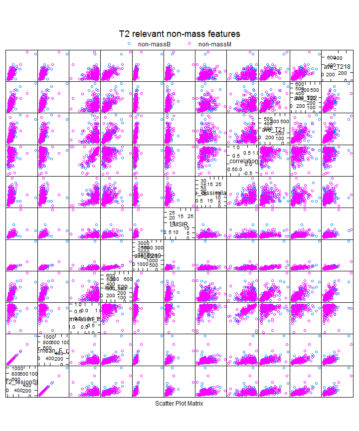

What features are most predictive of BIRADS T2SI?
================

```r
require(ggplot2)
```

```
## Loading required package: ggplot2
```

```r
library("RSQLite")
```

```
## Loading required package: DBI
```

```r
setwd("Z:/Cristina/MassNonmass/Section 2 - Experiments/featureRelevance")
```


```r
read_T2data <- function(subdata) {
    sqlite <- dbDriver("SQLite")
    conn <- dbConnect(sqlite, "stage1T2updatedFeatures.db")
    
    # 2) all T1W features
    lesionsQuery <- dbGetQuery(conn, "SELECT *\n           FROM  stage1features\n           INNER JOIN lesion ON (stage1features.lesion_id = lesion.lesion_id)\n           INNER JOIN f_T2 ON (stage1features.lesion_id = f_T2.lesion_id)")
    
    # prune entries and extract feature subsets corresponds to 5 entries
    # lesion info, 34 dynamic, 19 morpho, 34 texture fueatures
    lesionfields = names(lesionsQuery)
    lesioninfo = lesionsQuery[c(2, 130, 130:154)]
    T2info = lesionsQuery[c(155:202)]
    T2features = lesionsQuery[c(156, 153, 157, 165:166, 168:202, 104:123)]
    
    T2features$lesion_label <- as.factor(T2features$lesion_label)
    summary(T2features$lesion_label)
    
    
    if (subdata == "mass") {
        # organized the data by subdata
        M <- subset(T2features, lesion_label == "massB" | lesion_label == "massM")
        M$lesion_label <- ifelse(M$lesion_label == "massB", "NC", "C")
        T2features = M
        
    }
    if (subdata == "nonmass") {
        # organized the data by subdata
        N <- subset(T2features, lesion_label == "nonmassB" | lesion_label == 
            "nonmassM")
        N$lesion_label <- ifelse(N$lesion_label == "nonmassB", "NC", "C")
        T2features = N
        
    }
    if (subdata == "stage1") {
        # organized the data by subdata
        M <- subset(T2features, lesion_label == "massB" | lesion_label == "massM")
        M$lesion_label <- ifelse(M$lesion_label == "massB", "mass", "mass")
        N <- subset(T2features, lesion_label == "nonmassB" | lesion_label == 
            "nonmassM")
        N$lesion_label <- ifelse(N$lesion_label == "nonmassB", "nonmass", "nonmass")
        T2features = data.frame(rbind(M, N))
        
    }
    
    # procees data
    T2features$lesion_label <- as.factor(T2features$lesion_label)
    
    return(T2features)
}

# read datasets
T2massfeatures = read_T2data(subdata = "mass")
T2nonmassfeatures = read_T2data(subdata = "nonmass")
T2allfeatures = read_T2data(subdata = "all")

# format datasets for B or M
T2allfeaturesBorM = T2allfeatures
T2massfeaturesBorM = T2massfeatures
T2nonmassfeaturesBorM = T2nonmassfeatures
```


```r
T2allfeaturest2_signal = na.omit(T2allfeatures)
summary(T2allfeaturest2_signal$lesion_label)
```

```
##    fociB    fociM    massB    massM nonmassB nonmassM 
##        4        2      227      155      111       74
```

```r

T2featurest2_signal = cbind(T2allfeaturest2_signal[3], T2allfeaturest2_signal[-3][2:59])

# first predict between Hyperintense and Hypointensity
BIRADS_HyperHypo = T2featurest2_signal[T2featurest2_signal$find_t2_signal_int != 
    "None", ]
BIRADS_HyperHypo = BIRADS_HyperHypo[BIRADS_HyperHypo$find_t2_signal_int != "Slightly hyperintense", 
    ]
BIRADS_HyperHypo$find_t2_signal_int = as.factor(BIRADS_HyperHypo$find_t2_signal_int)
summary(BIRADS_HyperHypo$find_t2_signal_int)
```

```
##            Hyperintense Hypointense or not seen 
##                     101                     153
```

```r

# Random Forest feature relevance
library("Boruta")
```

```
## Loading required package: randomForest
## randomForest 4.6-7
## Type rfNews() to see new features/changes/bug fixes.
```

```r
set.seed(1)
BIRADS_HyperHypo_Boruta <- Boruta(find_t2_signal_int ~ . - lesion_label, data = BIRADS_HyperHypo, 
    doTrace = 2, ntree = 5000)
```

```
## Initial round 1: ..........
##  29  attributes rejected after this test:  T2_lesionSIstd T2min_F_r_i T2mean_F_r_i T2var_F_r_i T2RGH_mean T2RGH_var T2texture_homogeneity_quarterRad T2texture_homogeneity_threeQuaRad T2texture_correlation_halfRad T2texture_ASM_zero T2texture_ASM_quarterRad T2texture_ASM_halfRad T2texture_ASM_threeQuaRad T2texture_energy_zero T2texture_energy_quarterRad T2texture_energy_halfRad T2texture_energy_threeQuaRad ave_T21 ave_T22 ave_T23 ave_T24 ave_T26 ave_T28 ave_T211 ave_T212 ave_T213 ave_T216 ave_T217 ave_T219 
## 
## Initial round 2: ..........
## Initial round 3: ..........
##  1  attributes rejected after this test:  T2texture_correlation_threeQuaRad 
## 
## Final round: ..........
##  8  attributes rejected after this test:  T2_lesionSI T2max_F_r_i T2kurt_F_r_i T2grad_margin T2texture_contrast_zero ave_T20 ave_T29 ave_T214 
## ....
##  1  attributes confirmed after this test:  ave_T215 
## ....
##  1  attributes confirmed after this test:  T2texture_dissimilarity_halfRad 
## 
##  3  attributes rejected after this test:  T2texture_homogeneity_halfRad T2texture_dissimilarity_threeQuaRad T2texture_correlation_quarterRad 
## .........
##  1  attributes rejected after this test:  ave_T25 
## ...
##  1  attributes confirmed after this test:  T2texture_contrast_quarterRad 
## .....
##  1  attributes rejected after this test:  T2texture_dissimilarity_zero 
## ...
##  1  attributes rejected after this test:  ave_T218 
## ...........
##  1  attributes rejected after this test:  T2grad_margin_var 
## .....
##  1  attributes confirmed after this test:  T2texture_contrast_halfRad 
## .....
##  1  attributes confirmed after this test:  T2texture_contrast_threeQuaRad 
## ..
##  1  attributes rejected after this test:  ave_T27 
## .......................................
```

```r

print(BIRADS_HyperHypo_Boruta)
```

```
## Boruta performed 130 randomForest runs in 8.939 mins.
##         5 attributes confirmed important:
## T2texture_contrast_quarterRad T2texture_contrast_halfRad
## T2texture_contrast_threeQuaRad T2texture_dissimilarity_halfRad
## ave_T215
##         46 attributes confirmed unimportant: T2_lesionSI
## T2_lesionSIstd T2min_F_r_i T2max_F_r_i T2mean_F_r_i T2var_F_r_i
## T2kurt_F_r_i T2grad_margin T2grad_margin_var T2RGH_mean T2RGH_var
## T2texture_contrast_zero T2texture_homogeneity_quarterRad
## T2texture_homogeneity_halfRad T2texture_homogeneity_threeQuaRad
## T2texture_dissimilarity_zero T2texture_dissimilarity_threeQuaRad
## T2texture_correlation_quarterRad T2texture_correlation_halfRad
## T2texture_correlation_threeQuaRad T2texture_ASM_zero
## T2texture_ASM_quarterRad T2texture_ASM_halfRad
## T2texture_ASM_threeQuaRad T2texture_energy_zero
## T2texture_energy_quarterRad T2texture_energy_halfRad
## T2texture_energy_threeQuaRad ave_T20 ave_T21 ave_T22 ave_T23
## ave_T24 ave_T25 ave_T26 ave_T27 ave_T28 ave_T29 ave_T211 ave_T212
## ave_T213 ave_T214 ave_T216 ave_T217 ave_T218 ave_T219
##         6 tentative attributes left: LMSIR T2skew_F_r_i
## T2texture_homogeneity_zero T2texture_dissimilarity_quarterRad
## T2texture_correlation_zero ave_T210
```

```r


# second predict between Hyperintense and Slightly hyperintense
BIRADS_HyperSligHyper = T2featurest2_signal[T2featurest2_signal$find_t2_signal_int != 
    "None", ]
BIRADS_HyperSligHyper = BIRADS_HyperSligHyper[BIRADS_HyperSligHyper$find_t2_signal_int != 
    "Hypointense or not seen", ]
BIRADS_HyperSligHyper$find_t2_signal_int = as.factor(BIRADS_HyperSligHyper$find_t2_signal_int)
summary(BIRADS_HyperSligHyper$find_t2_signal_int)
```

```
##          Hyperintense Slightly hyperintense 
##                   101                    63
```

```r

set.seed(2)
BIRADS_HyperSligHyper_Boruta <- Boruta(find_t2_signal_int ~ . - lesion_label, 
    data = BIRADS_HyperSligHyper, doTrace = 2, ntree = 5000)
```

```
## Initial round 1: ..........
##  44  attributes rejected after this test:  T2_lesionSIstd T2max_F_r_i T2var_F_r_i T2skew_F_r_i T2kurt_F_r_i T2grad_margin T2grad_margin_var T2RGH_mean T2RGH_var T2texture_contrast_zero T2texture_contrast_quarterRad T2texture_contrast_halfRad T2texture_contrast_threeQuaRad T2texture_homogeneity_zero T2texture_homogeneity_quarterRad T2texture_homogeneity_halfRad T2texture_homogeneity_threeQuaRad T2texture_dissimilarity_zero T2texture_dissimilarity_quarterRad T2texture_dissimilarity_halfRad T2texture_dissimilarity_threeQuaRad T2texture_correlation_halfRad T2texture_correlation_threeQuaRad T2texture_ASM_zero T2texture_ASM_quarterRad T2texture_ASM_halfRad T2texture_ASM_threeQuaRad T2texture_energy_zero T2texture_energy_quarterRad T2texture_energy_halfRad T2texture_energy_threeQuaRad ave_T22 ave_T25 ave_T26 ave_T27 ave_T29 ave_T210 ave_T211 ave_T213 ave_T214 ave_T215 ave_T216 ave_T217 ave_T218 
## 
## Initial round 2: ..........
## Initial round 3: ..........
## Final round: ..........
##  4  attributes rejected after this test:  T2_lesionSI T2mean_F_r_i ave_T21 ave_T28 
## ........
##  3  attributes confirmed after this test:  LMSIR T2min_F_r_i T2texture_correlation_zero 
## ...
##  1  attributes confirmed after this test:  T2texture_correlation_quarterRad 
## ..............................................................
##  1  attributes rejected after this test:  ave_T20 
## .................
```

```r
print(BIRADS_HyperSligHyper_Boruta)
```

```
## Boruta performed 130 randomForest runs in 5.241 mins.
##         4 attributes confirmed important: LMSIR T2min_F_r_i
## T2texture_correlation_zero T2texture_correlation_quarterRad
##         49 attributes confirmed unimportant: T2_lesionSI
## T2_lesionSIstd T2max_F_r_i T2mean_F_r_i T2var_F_r_i T2skew_F_r_i
## T2kurt_F_r_i T2grad_margin T2grad_margin_var T2RGH_mean T2RGH_var
## T2texture_contrast_zero T2texture_contrast_quarterRad
## T2texture_contrast_halfRad T2texture_contrast_threeQuaRad
## T2texture_homogeneity_zero T2texture_homogeneity_quarterRad
## T2texture_homogeneity_halfRad T2texture_homogeneity_threeQuaRad
## T2texture_dissimilarity_zero T2texture_dissimilarity_quarterRad
## T2texture_dissimilarity_halfRad
## T2texture_dissimilarity_threeQuaRad T2texture_correlation_halfRad
## T2texture_correlation_threeQuaRad T2texture_ASM_zero
## T2texture_ASM_quarterRad T2texture_ASM_halfRad
## T2texture_ASM_threeQuaRad T2texture_energy_zero
## T2texture_energy_quarterRad T2texture_energy_halfRad
## T2texture_energy_threeQuaRad ave_T20 ave_T21 ave_T22 ave_T25
## ave_T26 ave_T27 ave_T28 ave_T29 ave_T210 ave_T211 ave_T213
## ave_T214 ave_T215 ave_T216 ave_T217 ave_T218
##         4 tentative attributes left: ave_T23 ave_T24 ave_T212
## ave_T219
```


```r
library("caret")
```

```
## Loading required package: cluster
## Loading required package: foreach
## Loading required package: lattice
## Loading required package: plyr
## Loading required package: reshape2
```

```r
confirmedT2_HyperHypo <- BIRADS_HyperHypo_Boruta$finalDecision[BIRADS_HyperHypo_Boruta$finalDecision == 
    "Confirmed"]
tentativeT2_HyperHypo <- BIRADS_HyperHypo_Boruta$finalDecision[BIRADS_HyperHypo_Boruta$finalDecision == 
    "Tentative"]
confirmedT2_HyperHypo = BIRADS_HyperHypo[c(names(confirmedT2_HyperHypo), names(tentativeT2_HyperHypo))]

confirmedT2_HyperSligHyper <- BIRADS_HyperSligHyper_Boruta$finalDecision[BIRADS_HyperSligHyper_Boruta$finalDecision == 
    "Confirmed"]
tentativeT2_HyperSligHyper <- BIRADS_HyperSligHyper_Boruta$finalDecision[BIRADS_HyperSligHyper_Boruta$finalDecision == 
    "Tentative"]
confirmedT2_HyperSligHyper = T2nonmassfeatures[c(names(confirmedT2_HyperSligHyper), 
    names(tentativeT2_HyperSligHyper))]

super.sym <- trellis.par.get("superpose.symbol")
## plot for masses
splom(~BIRADS_HyperHypo[c(names(confirmedT2_HyperHypo))], groups = lesion_label, 
    data = BIRADS_HyperHypo, panel = panel.superpose, key = list(title = "T2 relevant BIRADS_HyperHypo features", 
        columns = 4, points = list(pch = super.sym$pch[1:4], col = super.sym$col[1:4], 
            fill = super.sym$col[1:4]), text = list(c("massB", "massM", "nonmassB", 
            "nonmassM"))))
```

 

```r

## plot for non-masses
splom(~BIRADS_HyperSligHyper[c(names(confirmedT2_HyperSligHyper))], groups = lesion_label, 
    data = BIRADS_HyperSligHyper, panel = panel.superpose, key = list(title = "T2 relevant BIRADS_HyperSligHyper features", 
        columns = 4, points = list(pch = super.sym$pch[1:4], col = super.sym$col[1:4]), 
        text = list(c("massB", "massM", "nonmassB", "nonmassM"))))
```

 

```r

# Now plot z-scores
rankings_HyperHypo <- BIRADS_HyperHypo_Boruta$ImpHistory
rankings_HyperSligHyper <- BIRADS_HyperSligHyper_Boruta$ImpHistory

Hypoframezscore_selected = {
}
# proces HyperHypo = 7
for (i in 1:length(confirmedT2_HyperHypo)) {
    cfeature = as.data.frame(confirmedT2_HyperHypo[i])
    HyperHypoframe = data.frame(zscores = rankings_HyperHypo[, colnames(cfeature)])
    HyperHypoframe$MorN = "HyperHypo"
    HyperHypoframe$feature = colnames(cfeature)
    Hypoframezscore_selected <- rbind(Hypoframezscore_selected, HyperHypoframe)
}

# add shadow mean
HyperHypoframe = data.frame(zscores = rankings_HyperHypo[, "shadowMean"])
HyperHypoframe$MorN = "HyperHypo"
HyperHypoframe$feature = "shadowMean"
Hypoframezscore_selected <- rbind(Hypoframezscore_selected, HyperHypoframe)

Hyperframezscore_selected = {
}

# proces SligHyper = 9
for (i in 1:length(confirmedT2_HyperSligHyper)) {
    cfeature = as.data.frame(confirmedT2_HyperSligHyper[i])
    HyperSligHyperframe = data.frame(zscores = rankings_HyperSligHyper[, colnames(cfeature)])
    HyperSligHyperframe$MorN = "HyperSligHyper"
    HyperSligHyperframe$feature = colnames(cfeature)
    Hyperframezscore_selected <- rbind(Hyperframezscore_selected, HyperSligHyperframe)
}

# add shadow mean
HyperSligHyperframe = data.frame(zscores = rankings_HyperSligHyper[, "shadowMean"])
HyperSligHyperframe$MorN = "HyperSligHyper"
HyperSligHyperframe$feature = "shadowMean"
Hyperframezscore_selected <- rbind(Hyperframezscore_selected, HyperSligHyperframe)

# plot for predicting Hyper vs. Hypo
p <- ggplot(Hypoframezscore_selected, aes(factor(feature), zscores, fill = factor(MorN)))
p + geom_boxplot() + coord_flip() + labs(title = "most predictive features for Hyper vs. Hypo")
```

 

```r

# for predicting Hyper vs. SligHyper
p <- ggplot(Hyperframezscore_selected, aes(factor(feature), zscores, fill = factor(MorN)))
p + geom_boxplot() + coord_flip() + labs(title = "most predictive features for Hyper vs. SligHyper")
```

 

```r


# together
zscore_selected = rbind(Hypoframezscore_selected, Hyperframezscore_selected)
summary(as.factor(zscore_selected$MorN))
```

```
##      HyperHypo HyperSligHyper 
##           1560           1170
```

```r

p <- ggplot(zscore_selected, aes(factor(feature), zscores, fill = factor(MorN)))
p + geom_boxplot() + coord_flip() + labs(title = "most predictive features BIRADS T2SI")
```

 


```r
save.image("Z:/Cristina/MassNonmass/Section 2 - Experiments/featureRelevance/Rdata/T2_featurespred_BIRADS_SI.RData")
```

