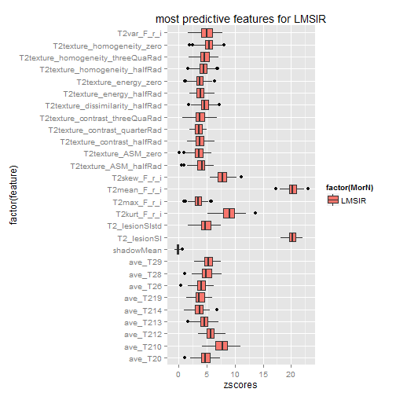

Since LMSIR is relevant for both malignancy prediction in non-masses (see T2_featureRelevance) and predictive of T2wBIRADSRSI
======


```r
require(ggplot2)
```

```
## Loading required package: ggplot2
```

```r
library("RSQLite")
```

```
## Loading required package: DBI
```

```r
setwd("Z:/Cristina/MassNonmass/Section 2 - Experiments/featureRelevance")
```


```r
read_T2data <- function(subdata) {
    sqlite <- dbDriver("SQLite")
    conn <- dbConnect(sqlite, "stage1T2updatedFeatures.db")
    
    # 2) all T1W features
    lesionsQuery <- dbGetQuery(conn, "SELECT *\n           FROM  stage1features\n           INNER JOIN lesion ON (stage1features.lesion_id = lesion.lesion_id)\n           INNER JOIN f_T2 ON (stage1features.lesion_id = f_T2.lesion_id)")
    
    # prune entries and extract feature subsets corresponds to 5 entries lesion info, 34 dynamic, 19 morpho, 34 texture fueatures
    lesionfields = names(lesionsQuery)
    lesioninfo = lesionsQuery[c(2, 130, 130:154)]
    T2info = lesionsQuery[c(155:202)]
    T2features = lesionsQuery[c(156, 153, 157, 165:166, 168:202, 104:123)]
    
    T2features$lesion_label <- as.factor(T2features$lesion_label)
    summary(T2features$lesion_label)
    
    
    if (subdata == "mass") {
        # organized the data by subdata
        M <- subset(T2features, lesion_label == "massB" | lesion_label == "massM")
        M$lesion_label <- ifelse(M$lesion_label == "massB", "NC", "C")
        T2features = M
        
    }
    if (subdata == "nonmass") {
        # organized the data by subdata
        N <- subset(T2features, lesion_label == "nonmassB" | lesion_label == "nonmassM")
        N$lesion_label <- ifelse(N$lesion_label == "nonmassB", "NC", "C")
        T2features = N
        
    }
    if (subdata == "stage1") {
        # organized the data by subdata
        M <- subset(T2features, lesion_label == "massB" | lesion_label == "massM")
        M$lesion_label <- ifelse(M$lesion_label == "massB", "mass", "mass")
        N <- subset(T2features, lesion_label == "nonmassB" | lesion_label == "nonmassM")
        N$lesion_label <- ifelse(N$lesion_label == "nonmassB", "nonmass", "nonmass")
        T2features = data.frame(rbind(M, N))
        
    }
    
    # procees data
    T2features$lesion_label <- as.factor(T2features$lesion_label)
    
    return(T2features)
}
```


What features are most predictive of LMSIR (for a predictive regressor)?
==================

```r
# format datasets for inquiring predictive power for LMSIR
T2allfeatures = read_T2data(subdata = "all")
T2allfeatures$origlesion_label = T2allfeatures$lesion_label
T2features_LMSIR = na.omit(cbind(T2allfeatures[6], T2allfeatures[-6][4:ncol(T2allfeatures) - 1]))

# Random Forest feature relevance
library("Boruta")
```

```
## Loading required package: randomForest
## randomForest 4.6-7
## Type rfNews() to see new features/changes/bug fixes.
```

```r
set.seed(1)
LMSIR_Boruta <- Boruta(LMSIR ~ . - origlesion_label, data = T2features_LMSIR, doTrace = 2, ntree = 1000)
```

```
## Initial round 1: ..........
##  5  attributes rejected after this test:  T2RGH_mean T2texture_correlation_threeQuaRad T2texture_ASM_quarterRad T2texture_energy_quarterRad T2texture_energy_threeQuaRad 
## 
## Initial round 2: ..........
##  2  attributes rejected after this test:  find_t2_signal_int T2texture_ASM_threeQuaRad 
## 
## Initial round 3: ..........
## Final round: ..........
##  4  attributes confirmed after this test:  T2_lesionSI T2mean_F_r_i T2skew_F_r_i T2kurt_F_r_i 
## 
##  5  attributes rejected after this test:  T2RGH_var T2texture_correlation_quarterRad ave_T211 ave_T215 ave_T216 
## ....
##  1  attributes confirmed after this test:  ave_T210 
## 
##  1  attributes rejected after this test:  ave_T21 
## ....
##  2  attributes rejected after this test:  ave_T22 ave_T24 
## ...
##  2  attributes rejected after this test:  T2grad_margin ave_T27 
## ...
##  3  attributes rejected after this test:  T2min_F_r_i T2texture_contrast_zero ave_T217 
## ...
##  1  attributes rejected after this test:  T2texture_homogeneity_quarterRad 
## ...
##  2  attributes confirmed after this test:  T2texture_homogeneity_zero ave_T212 
## 
##  2  attributes rejected after this test:  T2texture_correlation_zero ave_T23 
## .....
##  1  attributes rejected after this test:  ave_T218 
## ...
##  1  attributes rejected after this test:  ave_T25 
## .....
##  2  attributes rejected after this test:  T2grad_margin_var T2texture_dissimilarity_quarterRad 
## ...........
##  1  attributes rejected after this test:  T2texture_dissimilarity_zero 
## .....
##  1  attributes confirmed after this test:  ave_T29 
## ..
##  1  attributes confirmed after this test:  T2var_F_r_i 
## ..........
##  1  attributes rejected after this test:  T2texture_correlation_halfRad 
## ........
##  1  attributes confirmed after this test:  ave_T28 
## ....
##  1  attributes confirmed after this test:  T2texture_dissimilarity_halfRad 
## 
##  1  attributes rejected after this test:  T2texture_dissimilarity_threeQuaRad 
## .....
##  1  attributes confirmed after this test:  ave_T213 
## ............
```

```r
print(LMSIR_Boruta)
```

```
## Boruta performed 130 randomForest runs in 34.72 mins.
##         12 attributes confirmed important: T2_lesionSI T2mean_F_r_i T2var_F_r_i T2skew_F_r_i T2kurt_F_r_i T2texture_homogeneity_zero T2texture_dissimilarity_halfRad ave_T28 ave_T29 ave_T210 ave_T212 ave_T213
##         30 attributes confirmed unimportant: find_t2_signal_int T2min_F_r_i T2grad_margin T2grad_margin_var T2RGH_mean T2RGH_var T2texture_contrast_zero T2texture_homogeneity_quarterRad T2texture_dissimilarity_zero
## T2texture_dissimilarity_quarterRad T2texture_dissimilarity_threeQuaRad T2texture_correlation_zero T2texture_correlation_quarterRad T2texture_correlation_halfRad T2texture_correlation_threeQuaRad T2texture_ASM_quarterRad
## T2texture_ASM_threeQuaRad T2texture_energy_quarterRad T2texture_energy_threeQuaRad ave_T21 ave_T22 ave_T23 ave_T24 ave_T25 ave_T27 ave_T211 ave_T215 ave_T216 ave_T217 ave_T218
##         15 tentative attributes left: T2_lesionSIstd T2max_F_r_i T2texture_contrast_quarterRad T2texture_contrast_halfRad T2texture_contrast_threeQuaRad T2texture_homogeneity_halfRad T2texture_homogeneity_threeQuaRad
## T2texture_ASM_zero T2texture_ASM_halfRad T2texture_energy_zero T2texture_energy_halfRad ave_T20 ave_T26 ave_T214 ave_T219
```

```r

library("caret")
```

```
## Loading required package: cluster
## Loading required package: foreach
## Loading required package: lattice
## Loading required package: plyr
## Loading required package: reshape2
```

```r
confirmedT2_LMSIR <- LMSIR_Boruta$finalDecision[LMSIR_Boruta$finalDecision == "Confirmed"]
tentativeT2_LMSIR <- LMSIR_Boruta$finalDecision[LMSIR_Boruta$finalDecision == "Tentative"]
allT2_LMSIR = T2features_LMSIR[c(names(confirmedT2_LMSIR), names(tentativeT2_LMSIR))]

super.sym <- trellis.par.get("superpose.symbol")
## plot for masses
splom(~T2features_LMSIR[c(names(confirmedT2_LMSIR))], groups = origlesion_label, data = T2features_LMSIR, panel = panel.superpose, key = list(title = "T2 relevant LMSIR features", columns = 4, points = list(pch = super.sym$pch[1:4], col = super.sym$col[1:4], 
    fill = super.sym$col[1:4]), text = list(c("massB", "massM", "nonmassB", "nonmassM"))))
```

 

```r


# Now plot z-scores
rankings_LMSIR <- LMSIR_Boruta$ImpHistory

LMSIRframezscore_selected = {
}
# proces HyperHypo = 7
for (i in 1:length(allT2_LMSIR)) {
    cfeature = as.data.frame(allT2_LMSIR[i])
    LMSIRframe = data.frame(zscores = rankings_LMSIR[, colnames(cfeature)])
    LMSIRframe$MorN = "LMSIR"
    LMSIRframe$feature = colnames(cfeature)
    LMSIRframezscore_selected <- rbind(LMSIRframezscore_selected, LMSIRframe)
}

# add shadow mean
LMSIRframe = data.frame(zscores = rankings_LMSIR[, "shadowMean"])
LMSIRframe$MorN = "LMSIR"
LMSIRframe$feature = "shadowMean"
LMSIRframezscore_selected <- rbind(LMSIRframezscore_selected, LMSIRframe)

# plot for predicting Hyper vs. Hypo
p <- ggplot(LMSIRframezscore_selected, aes(factor(feature), zscores, fill = factor(MorN)))
p + geom_boxplot() + coord_flip() + labs(title = "most predictive features for LMSIR")
```

 


```r
save.image("Z:/Cristina/MassNonmass/Section 2 - Experiments/featureRelevance/Rdata/T2_featurespred_LMSIR.RData")
```


